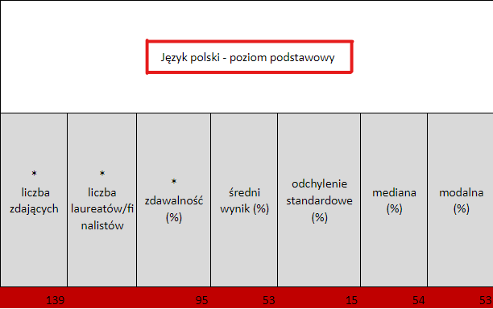

# Program do analiz matur

Autor: Miłosz Kułak 2aTP

> Ważne! aby rozpocząć prace należy umieścić plik z danymi w formacie .xls lub .xlsx
# Funkcje programu
 - Generuje tabele z wynikami dla każdego przedmiotu po podaniu nazwy nagłówka z pliku
;

- 
